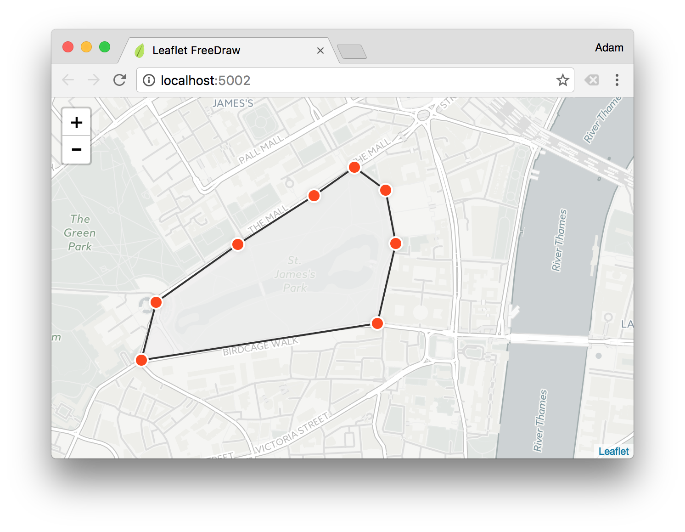

&nbsp;

&nbsp;

&nbsp;

> Use [Leaflet.draw](https://github.com/Leaflet/Leaflet.draw) for drawing pre-defined polygons and linear shapes &ndash; `Leaflet.FreeDraw`'s selling point is that it allows you to freely draw a polygon like [Zoopla](http://www.zoopla.co.uk/for-sale/map/property/london/?include_retirement_homes=true&include_shared_ownership=true&new_homes=include&q=London&results_sort=newest_listings&search_source=home&pn=1&view_type=map). Hulls are also supported to normalise polygons when users draw an insane polygon &ndash; currently `Leaflet.FreeDraw` supports Brian Barnett's [Graham Scan module](https://github.com/brian3kb/graham_scan_js) and my adaptation of the [concave hull algorithm](https://github.com/Wildhoney/ConcaveHull).

**Note:** For drawing polylines instead, try [`L.Pather`](https://github.com/Wildhoney/L.Pather).

* **npm:** `npm i leaflet.freedraw`
* **Bower:** `bower i leaflet.freedraw`

---
