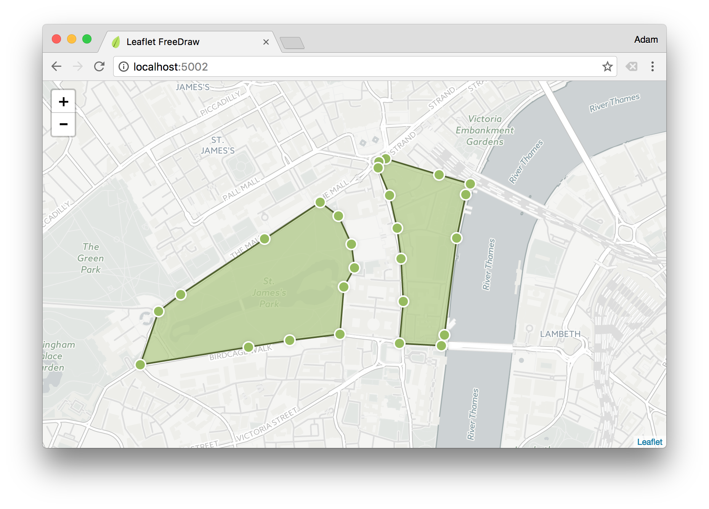

> FreeDraw allows the free-hand drawing of shapes on your Leaflet.js map layer &ndash; providing an intuitive and familiar UX for creating geospatial boundaries similar to [Zoopla](http://www.zoopla.co.uk/for-sale/map/property/london/?include_retirement_homes=true&include_shared_ownership=true&new_homes=include&q=London&results_sort=newest_listings&search_source=home&pn=1&view_type=map) and others. Included out-of-the-box is the [concaving of polygons](http://ubicomp.algoritmi.uminho.pt/local/concavehull.html), polygon merging and simplifying, as well as the ability to add edges and modify existing shapes.
> **Note:** For drawing polylines instead, try [`L.Pather`](https://github.com/Wildhoney/L.Pather).

<sub><sup>For Leaflet pre-1.0.0 please use [`v1.2.2`](https://github.com/Wildhoney/Leaflet.FreeDraw/tree/v1.2.2).</sup></sub>


&nbsp;

&nbsp;

&nbsp;


* **npm:** `npm i leaflet.freedraw`
* **Bower:** `bower i leaflet.freedraw`


## Table of Contents

1. [Browser Support](#browser-support)
2. [Getting Started](#getting-started)
  1. [Markers](#markers)
  2. [Modes](#modes)
  3. [Options](#options)
  4. [Classes](#classes)
  5. [Methods](#methods)
  


## Browser Support


<sub><sup>`FreeDraw` has been tested in IE10+</sup></sub>

## Getting Started

`FreeDraw` functions as a standard Leaflet module, meaning you initialise it and add it to your map layer via the `addLayer` function on your map instance &ndash; when you instantiate `FreeDraw` you can pass a set of [`options`](#options) for behaviour customisation.

```javascript
import L from 'leaflet';
import FreeDraw from 'leaflet-freedraw';

const map = new L.Map(node);
const freeDraw = new FreeDraw();
```

By attaching `FreeDraw` to your map layer, an SVG node will be appended to the DOM, and mouse event listeners will be attached to the `map` instance for creating and managing the geospatial polygons.

### Markers

When a user creates a polygon an event is fired on the `map` instance called `markers` which you can listen for by using the native Leaflet `on` function.

```javascript
map.on('markers', event => {
    console.log(event.latLngs);
});
```

Once you have received the latitude and longitude values the next step would likely be to perform any necessary geospatial queries, and then render the relevant markers onto the map &ndash; for this you *could* use `L.Marker` and the native `addTo` method for [placing markers](http://leafletjs.com/reference-1.0.2.html#marker) on the map &ndash; however the important take-away is that `FreeDraw` doesn't concern itself with marker placement, as this is sufficiently covered by Leaflet.

### Modes

By default the mode is `ALL` which means all actions can be performed on the `FreeDraw` layer &mdash; create, edit, delete, and append &mdash; you're able to modify the mode at any time by using the `mode` method, or upon instantiation by passing an object as the first argument.

```javascript
import L from 'leaflet';
import FreeDraw, { CREATE, EDIT } from 'leaflet-freedraw';

const map = new L.Map(node);
const freeDraw = new FreeDraw({
    mode: CREATE | EDIT
});
```

By passing in the `mode` as `CREATE | EDIT` you're **only** allowing the user to create and edit polygons, they are not able to append edges, nor delete them. You may use the `mode` method post-instantiation to modify the `mode` at any time &ndash; in the case below to also allow deleting of polygons.

```javascript
// Allow create, edit and delete.
freeDraw.mode(CREATE | EDIT | DELETE);

// Allow everything except create.
freeDraw.mode(ALL ^ CREATE);

// Allow nothing.
freeDraw.mode(NONE);
```

> Note: Invoking `mode` without passing a mode simply returns the current mode.

### Options

All of the following options can be passed in when instantiating `FreeDraw` in the same way that we pass `mode` in the previous examples.

| Option              | Default      | Result                               |
| ------------------- |------------- | ------------------------------------ |
| `mode`              | `ALL`        | Modifies the default [mode](#modes). |
| `smoothFactor`      | `0.3`        | By how much to [smooth](http://leafletjs.com/reference-1.0.2.html#polyline-smoothfactor) the polygons.  |
| `elbowDistance`     | `10`         | Factor to determine when to delete or when to append an edge.  |
| `simplifyFactor`    | `1.1`        | By how much to [simplify](https://sourceforge.net/p/jsclipper/wiki/documentation/#clipperlibclippercleanpolygon) the polygon.  |
| `mergePolygons`     | `true`       | Whether to attempting merging of polygons that intersect.  |
| `concavePolygon`    | `true`       | Whether to apply the [concaving algorithm](http://ubicomp.algoritmi.uminho.pt/local/concavehull.html) to the polygons.  |
| `recreatePostEdit`  | `false`      | Whether to recreate the polygons subsequent to them being modified.  |

By using the options above we can tweak how `FreeDraw` functions &ndash; whilst some of the options have obvious effects, others are much more *tweak and see* based on your expected outcome &ndash; such as the subjective `simplifyFactor` and `elbowDistance` options.

### Classes

Depending on the current modes active on the map instance, the relevant classes are applied to the `map` container that you instantiated `L.Map` with &ndash; by using these class names it allows you to tailor the UX to the current mode, such as changing the `cursor` to `crosshair` when the user is allowed to create polygons.

| Class Name          | Mode         |
| ------------------- |------------- |
| `mode-none`         | `NONE`       |
| `mode-create`       | `CREATE`     |
| `mode-edit`         | `EDIT`       |
| `mode-delete`       | `DELETE`     |
| `mode-append`       | `APPEND`     |

From the above example if the current mode is `CREATE | EDIT | APPEND` then the **three** class names that will be present on the `map` node will be `mode-create`, `mode-edit` and `mode-append`, allowing you to provide a better UX from within your attached stylesheet.

### Methods

With the instance of `freeDraw` there are certain methods for manipulating `FreeDraw` directly, such as creating polygon from a set of latitude and longitude values.

| Method              | Yields       | Result                                                         |
| ------------------- |------------- | -------------------------------------------------------------- |
| `create`            | `Array`      | Creates a polygon by passing an array of `LatLng`s             |
| `remove`            | `void`       | Removes a polygon that is yielded from `create`                |
| `clear`             | `void`       | Clears all polygons from the current instance                  |
| `mode`              | `Number`     | Sets and retrieves the current [`mode`](#modes).               |
| `cancel`            | `void`       | Cancels the current create action &ndash; such as on escape.   |